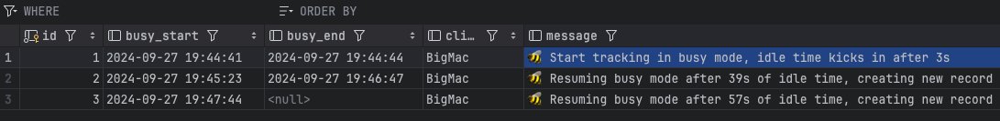

image:https://github.com/tillkuhn/billy-idle/actions/workflows/go.yml/badge.svg[ci-build]

== 💤 Billy Idle - Lightweight MacOS (In)activity Tracker

Simple busy / idle time tracker inspired by the ancient article https://www.dssw.co.uk/blog/2015-01-21-inactivity-and-idle-time/[Inactivity and Idle Time on OS X]. Background:  OS X has a timer called HIDIdleTime that tracks the last time you interacted with the computer.

== Run

[source,shell]
----
$ go run main.go

2024/09/27 19:44:41 [BigMac] 🐝 Start tracking in busy mode, idle time kicks in after 3s
2024/09/27 19:44:44 [BigMac] 💤 Switched to idle mode after 3s of busy time, completing record #1
2024/09/27 19:45:23 [BigMac] 🐝 Resuming busy mode after 39s of idle time, creating new record
2024/09/27 19:46:47 [BigMac] 💤 Switched to idle mode after 1m24s of busy time, completing record #2
2024/09/27 19:47:44 [BigMac] 🐝 Resuming busy mode after 57s of idle time, creating new record
^C
2024/09/27 19:47:46 [BigMac] 🐝 Stopped at Fri, 27 Sep 2024 19:48:32 CEST
----

== Database Support

*Billy Idle* currently only support a local https://gitlab.com/cznic/sqlite[sqlite] database, more precisely `modernc.org/sqlite` which is a cgo-free port of SQLite. But it shouldn't be a big deal to add support for a remote https://www.postgresql.org[PostgreSQL] Database.

== 🎸 Credits

image:https://upload.wikimedia.org/wikipedia/commons/thumb/7/74/Billy_idol_ill_artlibre_jnl.png/640px-Billy_idol_ill_artlibre_jnl.png[]
Source: https://commons.wikimedia.org/wiki/File:Billy_idol_ill_artlibre_jnl.png[Wikimedia Commons], terms of the https://en.wikipedia.org/wiki/en:Free_Art_License[Free Art License] apply.

== Contribution

If you want to contribute to *rubin* please have a look at the [contribution guidelines](./CONTRIBUTING.md).
